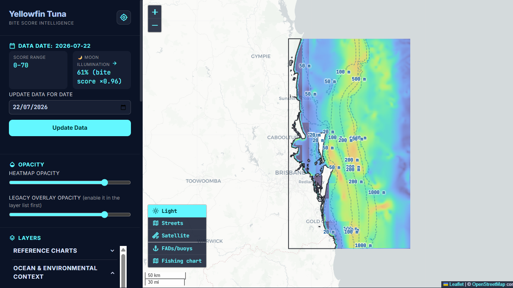
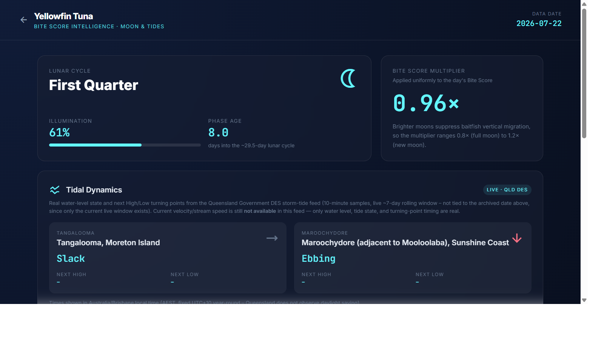

# Fisher — Yellowfin Tuna Bite Score

**An interactive GIS heat map for finding tuna and other large pelagics off Southeast Queensland, Australia.**

## What is this?

Fisher combines satellite sea-surface temperature, chlorophyll, currents, sea-surface height, mixed-layer depth, and high-resolution bathymetry into a single **Bite Score** — a 0–100 rating of how promising a patch of ocean looks for tuna and other large pelagic fish on a given day. The score is computed with a weighted linear combination of ocean and structural signals, then rendered as a heatmap over an interactive Leaflet map covering the **Sunshine Coast, Brisbane, and Gold Coast** coastline.

On top of the heatmap, the dashboard layers in bathymetry contours, FADs/wave buoys, a georeferenced fishing chart, high-resolution seabed surveys, and a moon/tide intelligence page — so you can go from "where's the water conditions good?" to "when's the best window to actually be there?" in one place.

## Main dashboard


*The main map: a Bite Score heatmap with bathymetry contours over the SEQ coastline, a sidebar with the current data date, score range, moon multiplier, an update-data date picker, opacity sliders, and collapsible layer groups — plus a bottom-left panel for switching basemaps and toggling reference charts.*

## Key features

- **Bite Score heatmap** — daily 0–100 suitability score blended from SST, chlorophyll, currents, sea-surface height anomaly, mixed-layer depth, and bathymetry, with each contributing factor individually selectable as its own map layer.
- **Bathymetry & reference charts** — depth contour lines, a georeferenced fishing chart, and FADs/wave buoy markers, quick-toggleable from a dedicated control panel.
- **High-resolution bathymetry surveys** — Sunshine Coast LiDAR, AusSeabed Moreton Bay Approaches, and Mudjimba Island multibeam surveys rendered as relief-shaded overlays, plus a whole-domain relief map.
- **Basemap switcher** — Light, Streets, and Satellite tile layers.
- **Moon & tide intelligence** — a dedicated page with lunar phase, illumination-driven score multiplier, moonrise/moonset, solunar peak fishing windows, and live tidal state from the Queensland Government DES feed.
- **Historical dates** — every processed day is archived and instantly browsable without re-running the pipeline.
- **One-click data updates** — trigger a fresh pipeline run for any date straight from the dashboard.

## Moon & Tides


*The `/moon/<date>` page: lunar phase and illumination, the resulting Bite Score multiplier, live tidal dynamics for Tangalooma and Maroochydore from the Queensland Government DES storm-tide feed, moonrise/moonset, and solunar peak fishing windows.*

## Getting started

### Prerequisites

- Python 3.12 (the project is developed and tested against 3.12.10; no strict version pin is declared, but a recent Python 3 is expected).
- No GPU or database required — everything runs locally.

### Install

```powershell
pip install -r requirements.txt
```

### Run the offline demo (no credentials needed)

Generates synthetic ocean data for the SEQ area of interest and runs it through the real scoring pipeline — good for a first look without any API keys:

```powershell
python run_demo.py
```

### Run the dashboard

```powershell
python -m bite_score.webapp
```

This starts a local server on **port 8765** and opens your browser automatically (use `--no-browser` to skip that, or `--port <N>` to change the port). Open **http://localhost:8765/** to view the map, and use the "Update Data" control in the sidebar to process a new date. The Moon & Tides page is available at `/moon/<date>`.

### Run the full pipeline for a real date

Regenerating real (non-demo) data requires a [Copernicus Marine](https://marine.copernicus.eu/) account and a local GEBCO/AusSeabed bathymetry NetCDF file:

```powershell
python -m bite_score.main --date 2026-07-18
```

Log in once with `copernicusmarine login`, or set `COPERNICUSMARINE_SERVICE_USERNAME` / `COPERNICUSMARINE_SERVICE_PASSWORD` (and `BATHYMETRY_NC_PATH` if your bathymetry file lives somewhere other than `data/gebco_seq.nc`) via a local `.env` file. `main.py` also accepts `--version {v1,v2,lenigas}` to run one of the alternate scoring models under active development, each archived to its own subfolder under `output/history/<date>/`.

## Data sources

- **[Copernicus Marine Service](https://marine.copernicus.eu/)** — ocean currents, sea-surface height, and mixed-layer depth model data.
- **[NOAA CoastWatch ERDDAP](https://coastwatch.pfeg.noaa.gov/erddap/)** — satellite sea-surface temperature (NASA JPL MUR SST) and chlorophyll (NOAA VIIRS), with Copernicus fallbacks when a satellite granule isn't available.
- **[GEBCO](https://www.gebco.net/)** bathymetry, merged with local high-resolution surveys (Sunshine Coast LiDAR and Geoscience Australia AusSeabed multibeam data) for improved nearshore depth accuracy.
- **Queensland Government Department of Environment and Science (DES)** storm-tide feed — live tidal state and turning points for Tangalooma and Maroochydore.

## Running tests

The project has a pytest suite covering the scoring pipeline, overlays, moon phase, tides, and structure layers (194 tests at the time of writing):

```powershell
python -m pytest
```

## A note on the predictions

Bite Score, solunar windows, and moon-phase multipliers are heuristic guides built from real oceanographic and astronomical data — not a guarantee of a bite. Conditions on the water can change quickly; always check current local marine and weather forecasts before heading out.
